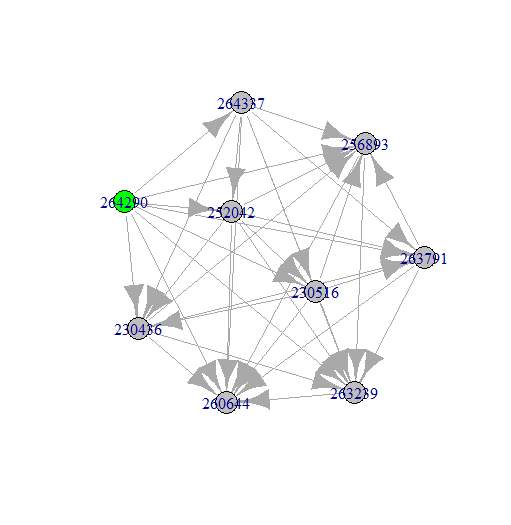

# ordinary_methods

<!-- badges: start -->

<!-- badges: end -->

Ordinary methods are Reasearch Operational tools to ranking a list of choice and choose the best option in a simple way. Here, we can see three of them: Borda Count, Copeland Count and Condorcet.

Borda and Copeland are more intuitives, Condorcert requires a comparision among all the players to score positively, negatively or zeros.

Another difference is that the result of Borda and Copeland can be a simple ranking, but to see the best result of Condorcet using a graph is the best way.

{width="350"}

So the question that I will use to work with these methods was: **if I have to choose the best Brazilian soccer player up to 23 years old and who plays as a striker, what would be the best possible bet?**

Based on a database of FIFA 2022 players available on the website Kaggle, players who had the following characteristics were filtered:

-   be Brazilian

-   be up to 23 years old

-   play in the striker position (in English, "ST" from "striker")

A dataset of 21 players with these characteristics was obtained. Next, 9 variables were selected, listed below:

-    Fifa ID

-   height_cm

-   weak_foot

-   skill_moves

-   pace

-   shooting

-   passing

-   dribbling

-   defending

-   physical

For ease, it was assumed that the higher the score in these variables (with the exception of the variable FIFA ID which is uniquely identifying), the stronger the candidate would be to top the rankings.

The three methods used showed the same result, the player Pablo Felipe among the 21 options is what was best evaluated for the 9 variables analyzed.

All analyzes were developed in R language.

*This content was produced by me at the Workshop of MBBA in Operations Research and Decision Making. Questions, comments and contributions are welcome.*
